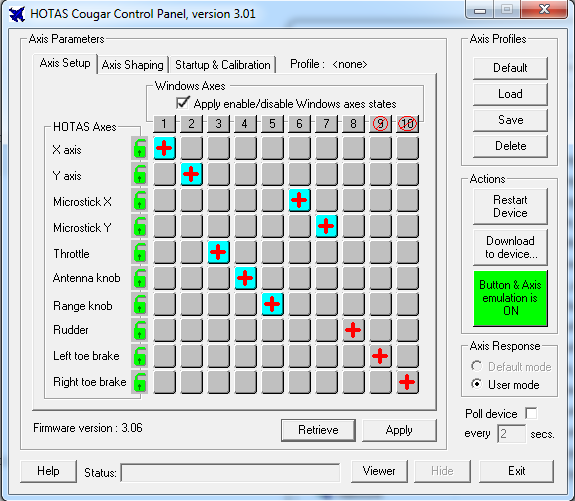

# Cougar Util - Version 0.1

Provides support for configuring a Cougar HOTAS in Linux.

Upon plugging in a pre-configured Cougar, it will be in a default
axis, no button emulation, automatic calibration mode, however any user
profile, tmj/tmm and manual calibration data you may have uploaded via windows
or this utility is retained in the Cougar's flash.

This utility allows setting the three configuration options within the Cougar
to make use of the pre-configured data. Selection of default or user axis
profile, using manual or automatic calibration data and enabling/disabling
button/axis emulation.

In a way this utility provides similar functionality to that of the
HOTAS CCP application that runs during windows startup to configure the
device. It does not recreate the full configuration abilities that HOTAS CCP
or indeed Foxy provides.

If your Cougar has previously been fully configured in Windows using HOTAS CCP
skip to the Basic Usage section. If you do not have access to windows you
can still configure your Cougar from Linux with this utility by making
use of a few bundled config files. Refer to the "Fresh Setup" section.

This utility only supports a single connected Cougar HOTAS. Connections will
be made to the first detected device in the case of several matching 
vid:pid devices.

Further support to reduce the reliance on access to a Windows machine is
covered in the "Thoughts on the Future" section.


## Building

Requires:
   * libusb-1.0 and libusb-1.0-dev.
   * libcrypto++6 and libcrypto++-dev

Run make in the root directory and copy the resulting cougar-util binary
to a suitable location for example /usr/local/bin

## Quickstart
### Basic Usage

Assuming your Cougar has been one-time configured in Windows and you just want
to use it as is in Linux, most users will simply need to run this utility with
the following switches:

```bash
  ./cougar-util -u -e -m
```

Which will activate the existing user profile mapping, enable button and axis 
emulation and enable your manual calibration data.

Run the utility with -h for help.

Running ./cougar-util with no options will configure the Cougar to the same
state it would be in if you disconnect and reconnect the device. Default axis
profile, no emulation, automatic calibration.

NOTE: cougar-util will need to be run as root in order to access the usb device.
Refer to the "Automatic Configuration" section for alternatives.


### Fresh Setup

This utility allows a nearly complete reconfiguration of the Cougar HOTAS with 
the exception of generating manual calibration data. If you do not have access
to Windows to perform manual calibration and save the resulting TCM file
for usage with this utility, you will need to keep your cougar in automatic
calibration mode.

#### Step 1
If your Cougar already has working firmware, this step may be skipped. 

To flash firmware, first obtain "HOTASUpdate.exe". It ships with the Windows
drivers and can be extracted via wine. This file is not bundled due to 
copyright restrictions. Only version 3.00.6 revB of the firmware is supported
for upload, to check you have the correct HOTASUpdate.exe file the sha256sum
of the file should match:

```
d91314c4326eb49f2298d5bbf024fac8d8c694e057ab769dc1fda931cb7f3db5  config/HOTASUpdate.exe
```

The utility will refuse to upload the new firmware if the firmware hash does not match.

```bash
root@icarus:# ./cougar-util -f config/HOTASUpdate.exe 
********************************************************************************
*    WARNING WARNING WARNING WARNING WARNING WARNING WARNING WARNING WARNING   *
********************************************************************************

Thrustmaster recommend you DISCONNECT your THROTTLE from the Cougar before uploading
new firmware. Users have reported permanent damage to the throttle if left connected.
Firmware update is at your own risk.

Before proceeding, unplug your Cougar (and disconnect your throttle) then whilst
holding down the trigger, plug your Cougar back in. Keep the trigger held down for
at least four seconds after connection to wipe any existing firmware. Then release
the trigger and wait a few more seconds for Linux to re-detect the device.

Proceed with firmware (3.00.6 revB) upload version ? (y/n): y
Uploading firmware. This may take several seconds to complete...

Firmware upload complete. Please disconnect your Cougar, re-attach the throttle and
reconnect. Wait a few seconds for device detection then move each axis through its
full range of motion, holding at each limit for 3 seconds to allow auto calibration
to work.

Once you have completed auto calibration, press ENTER exit.
```

#### Step 2

To fully setup the Cougar for Falcon BMS. You will want to upload your own (or the bundled)
TCM axis profile as well as optionally one of the compiled Dunc TMJ files (maps wheel
brakes + autopilot override to the paddle).

```bash
root@icarus:# ./cougar-util -p config/rdr-cursor-on.tmc -t config/dunc_dx_replacement.bin -u -e
```

The above will upload both files and enable button emulation. Note, if you are using your own TCM
file that you generated in Windows and did the manual calibration step before saving, you can add
the -m switch to request the Cougar make use of the manual calibration data. Do not use "-m" when
using the bundled TCM as it includes my calibration data which is unlikely to be of any use to you.

The bundled rdr-cursor-on.tmc enables support for the RDR Cursor axis at the expense
of the rudder toe brake axes (see Falcon BMS Cougar setup docs for more information).
Upload only needs to be performed once. After that use the "-u" option to activate
the profile.


#### Step 3

To avoid having to re-run the utility each time you connect your Cougar, please refer to 
the Automatic Configuration section.


## Options

```
  -u    Selects "user" axis profile, otherwise the "default" profile is used.
```

Using a user profile is required if you've made changes to the axes curves or
swapped the RDR Cursor and toe brake axis. The image below shows such a setup
in HOTAS CCP.



```
  -e    Turns button emulation on, otherwise button emulation is off.
```

Button emulation is only required if you're making use of a tmj/tmm file
which outputs key presses or axis values. When off, only regular DX button
presses will be generated. For example, you should enable button emulation
if you've loaded the dunc_replacement tmj/tmm file via Foxy which turns the
paddle switch into a dual function, autopilot override + wheel brake application.

```
  -m    Enables manual calibration mode, otherwise automatic calibration is used.
```

In automatic calibration mode, the Cougar will determine axis limits through
general usage of the device. Moving every axis through its full range of
motion and holding each axis at that limit for 3 seconds is sufficient to
calibrate.

Users of force mods such as the FSSB/FCC however will want to use manual
calibration mode. Otherwise the more pressure you place on the joystick
the further the pressure range will increase making it difficult to reliably
hit the same max limit.

You will need to perform a one-time manual calibration via HOTAS CCP in Windows.
After which using "-m" will ensure the manual data is used. Note, it's
recommended to leave each axis as linear, do not apply curves, Falcon BMS
will handle this for you.

```
  -p    Allows a specified tmc axis profile to be uploaded to the Cougar's flash.
```

After configuring each axis in HOTAS CCP and making curve/deadzone adjustments
plus performing a manually calibration, any TMC file you then save can be uploaded
from Linux using the above option.

You should also ensure the option "Apply enable/disable windows axes states"
is ticked prior to saving the TMC file.

NOTE: Uploaded TMC files include manual calibration data. You should only
use/upload TMC files you have generated yourself via HOTAS CCP if you intend
to enable manual calibration mode.

Uploaded TCM files are retained in the Cougar's flash between connections. You
only need to upload a profile once. After that use "-u" to activate the existing
profile.

```
  -t    Upload a binary TMJ file.
```

TMJ files must be compiled via Foxy on Windows. Only the resulting .BIN file
may be uploaded by this utility.

As with TCM files, you only need to upload the TMJ file once, although you
may wish to upload a different game specific TMJ BIN file if you use different
TMJ mappings with different games.

You will need to enable button/axis emulation via the "-e" switch to use the profile.

Refer to the "HOTASCompiler BIN Files" section for instructions on how to
compile TMJ to BIN.

```
  -f    Upload the specified firmware file to the Cougar
```

Due to the copyright restrictions it is unclear whether distribution of the Cougar
firmware is allowed. This utility can extract the firmware out of the HOTASUpdate.exe
that is a part of the Cougar Windows driver installation. Please obtain a copy
of HOTASUpdate.exe and specify its location via the "-f" option 
e.g "-f config/HOTASUpdate.exe".

The correct HOTASUpdate.exe should match this sha256sum

```
d91314c4326eb49f2298d5bbf024fac8d8c694e057ab769dc1fda931cb7f3db5  config/HOTASUpdate.exe
```

Once the firmware flashing process completes, you should disconnect the Cougar, re-attach
the throttle and connect again. After allowing a few seconds for Linux to detect the
joystick, move every axis through their full range of motion pausing for 3 seconds
at each limit. This allows auto calibration to occur.

Once you have completed auto calibration, press ENTER to exit.

With the exception of firmware, multiple upload options can be specified at once.
They will always complete in the order of "-p" profile upload, "-t" tjm upload and finally
applying "-e/-m/-u" options.


## Usage Examples

Activate user axis profile (for RDR Cursor), button emulation mode for
use by currently uploaded tmj/tmm profile and manual calibration data.

```bash
  ./cougar-util -u -e -m
```

Use manual calibration data. Button emulation is disabled and 
default axis mode selected.

```bash
  ./cougar-util -m
```

Select user axis profile, enable button emulation and use automatic calibration

```bash
  ./cougar-util -u -e
```

Upload and select a custom user axis profile. Button emulation will be off
and calibration mode will be automatic.

```bash
  ./cougar-util -p config/rdr-cursor-on.tmc
```

Upload tmj binary and enable button/axis emulation. Axis profile will switch
to default and calibration mode will be automatic.

```bash
  ./cougar-util -t config/dunc_dx_replacement.bin -e
```

Flash new firmware

```bash
  ./cougar-util -f config/HOTASUpdate.exe
```

Switch back to defaults, automatic calibration, default axis, button 
emulation off. Previously uploaded profile and manual calibration data is
retained and available for later activation.

```bash
  ./cougar-util
```

## Automatic Configuration

In most cases, upon connection of the Cougar you'll want to automatically
apply the user profile, manual calibration and emulation mode (or variation of)
without running the utility manually.

This can be achieved via a custom udev rule such as the one provided in
config/99-HOTAS.rules. To use, execute the following commands as root. If you
use a different path for cougar-util, ensure you update the udev rule accordingly.

```bash
   cp cougar-util /usr/local/bin
   cp config/99-HOTAS.rules /etc/udev/rules.d/
   udevadm trigger
```

Anytime you connect your Cougar it should now automatically be placed in user profile 
mode with manual calibration mode and axis/button emulation enabled.

Modify the 99-HOTAS.rules file if you wish to change the mode the Cougar will be 
placed in upon each connection.


## Bundled Configs

config/rdr-cursor-on.tmc - Moves the microstick x & y axis to 6/7 and moves
rudder and toe brakes to 8/9/10. This allows the microstick to be used in Falcon
BMS. It also enables the "Windows Axis" option allowing all 10 axes to be visible.

config/rdr-cursor-off.tmc - Moves microstick x & y axis to 9/10 and rudder/toe
brakes to 6/7/8. It also disables the "Windows Axis" option, only 7 axis will
be visible.

Note, if you use either of these tmc files, they contain manual calibration data
specific to my joystick. You should not enable manual calibration mode with these
files. Instead stick to automatic calibration mode or produce your own TCM files
via windows.

dunc_dx.bin and dunc_dx_replacement.bin are compiled versions of the Dunc TMJ/TMM
files that shipped with Falcon BMS 4.33-U5. Refer to the "HOTASCompiler BIN Files"
section if you wish to use different TMJ files from Linux.


## Thoughts on the Future

It would be nice to not need to use Windows at all to do the pre-configuration
but that cannot happen without further Linux utilities and additional feature
support in this utility to cover:-

  1. Firmware flashing                                     (supported)
  2. Perform manual calibration
  3. Configure axis mappings and generate tmc file
  4. Upload pre-made tmc                                   (supported) 
  5. Activate user/default tmc profile                     (supported)
  6. Compile tmj/tmm files
  7. Upload compiled tmj/tmm                               (supported)
  8. Enable/disable Emulation mode                         (supported)
  9. Select manual or automatic calibration                (supported) 

Of the unsupported options:-

"2" - I've not reversed the TMC file format yet which will be required
in order to merge new manual calibration data with existing profiles
and optionally saving back out to a new TMC. Generating this data isn't
difficult for simple linear based limits. Although there are no current
plans to support this, it may one day happen.

"3" - As with "2", TMC file format needs reversing. I understand the axis
mapping section, but have not spent time decoding the rest of the tcm file
yet. 

Even if TMC is fully reversed, the usefulness in supporting this is questionable.
Given that in most cases uploading a pre-made TMC that remaps the RDR Cursor
would be sufficient for most users with the only real modification being
merging manual calibration data which is unique to each cougar.

"6" - Compilation of tmj/tmm is not going to be supported. If you hear about
a compiler for tmj/tmm files that saves in the same bin format as
the HOTASCompiler produces (as a temporary file) please let me know.


## HOTASCompiler BIN Files

Whilst the Windows TMJ compiler does not produce an output file, there is a workaround
on Windows 7. HOTASCompiler.exe generates a BIN file in the Program Files(x86)/HOTAS/
directory with the name of the tmj you're compiling and the extension .BIN. Due to file
access restrictions, the generated temporary file is actually created in the Local
AppData VirtualStore HOTAS directory.

The snag is that HOTASCompiler deletes this file as soon as it's done. As a workaround
you can remove the Delete permission on the HOTAS directory. Properties/Security tab/
Advanced, Change permissions,Add, Enter Everyone for the object name, Ok, tick Deny
column for "Delete sub-folders and files" and then Apply and ok out.

You can now use Foxy to compile any TMJ/TMM file and find the corresponding bin
file in the virtual store. Generate a bin file for each TMJ game profile you wish
to use, transfer to Linux and then you can use the cougar-util with the "-t" option to
upload and switch between profiles.


## WARNING / DISCLAIMER

I have not properly reverse engineered the Cougar USB protocol and whilst I use
this application myself without issue, I take no responsibility nor provide any
guarantee that this utility will not cause any damage. Use at your own risk.


## Contact

Please let me know if you encounter any bugs and as always monetary support is
appreciated. Donations can be made via https://www.paypal.me/GPreston42

Gary Preston <gary@mups.co.uk>
