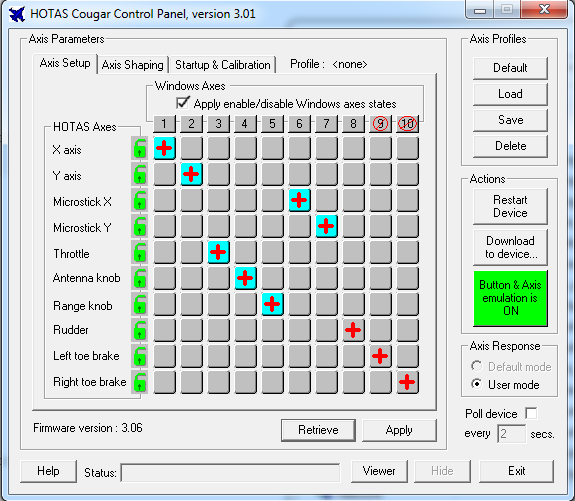

# Cougar Util

Provides support for using a pre-configured Cougar HOTAS in Linux.

Pre-configured in this instance means, User axis mapping, manual calibration
and uploading of a tmj/tmm file (if required) should have been performed
in Windows using the HOTAS CCP and Foxy software.

Upon plugging in the (pre-configured) Cougar, it will be in a default
axis, no button emulation, automatic calibration mode, however user
profile, tmj/tmm and manual calibration data from prior configuration
(in Windows) is retained in the Cougar's flash. 

This utility allows setting the three configuration options within the Cougar
to make use of the pre-configured data. Selection of default or user axis
profile, using manual or automatic calibration data and enabling/disabling
button/axis emulation.

In a way this utility provides similar functionality to that of the
HOTAS CCP application that runs during windows startup to configure the
device. It does not recreate the gui configuration abilities of HOTAS CCP
or indeed Foxy provides.

If you do not have access to Windows you can still mostly configure your
HOTAS. A bundled tcm profile allows the RDR Cursor axis to be remapped
for use in Falcon BMS, however due to embedded manual calibration data
you will need to stick to using automatic calibration mode when using the
bundled TCM.

Handles only a single connected Cougar HOTAS. Connections will be made
to the first detected device in the case of several matching vid:pid devices.

Further support to reduce the reliance on access to a Windows machine is
covered in the "Thoughts on the Future" section.

# Usage

Run the utility with -h for help.

Running ./cougar-util with no options will configure the Cougar to the same
state it would be in if you disconnect and reconnect the device. Default axis
profile, no emulation, automatic calibration.

Assuming your Cougar has been one-time configured in Windows, most users
will simply need to run this utility with the following switches:

```bash
  ./cougar-util -u -e -m
```

Which will activate the existing user profile mapping, enable button and axis 
emulation and enable your manual calibration data.

NOTE: cougar-util will need to be run as root in order to access the usb device.
Refer to the "Automatic Configuration" section for alternatives.


## Options

```
  -u    Selects "user" axis profile, otherwise the "default" profile is used.
```

Using a user profile is required if you've made changes to the axes curves or
swapped the RDR Cursor and toe break axis. The image below shows such a setup
in HOTAS CCP.



```
  -e    Turns button emulation on, otherwise button emulation is off.
```

Button emulation is only required if you're making use of a tmj/tmm file
which outputs key presses or axis values. When off, only regular DX button
presses will be generated. For example, you should enable button emulation
if you've loaded the dunc_replacement tmj/tmm file via Foxy which turns the
paddle switch into a dual function, autopilot override + wheel brake application.

```
  -m    Enables manual calibration mode, otherwise automatic calibration is used.
```

In automatic calibration mode, the Cougar will determine axis limits through
general usage of the device. Moving every axis through its full range of
motion and holding each axis at that limit for 3 seconds is sufficient to
calibrate.

Users of force mods such as the FSSB/FCC however will want to use manual
calibration mode. Otherwise the more pressure you place on the joystick
the further the pressure range will increase making it difficult to reliably
hit the same max limit.

You will need to perform a one-time manual calibration via HOTAS CCP in Windows.
After which using "-m on" will ensure the manual data is used. Note, it's
recommended to leave all axis as linear, do not apply curves, Falcon BMS
will handle this for you.

```
  -p    Allows a specified tmc axis profile to be uploaded to the Cougar's flash.
```

After configuring axes in HOTAS CCP and making curve/deadzone adjustments
plus performing a manually calibration, any TMC file you then save can be uploaded
from Linux using the above option.

You should also ensure the option "Apply enable/disable windows axes states"
is ticked prior to saving the TMC file.

NOTE: Uploaded TMC files include manual calibration data. You should only
use/upload TMC files you have generated yourself via HOTAS CCP if you intend
to plan to enable manual calibration mode.


# Other Notes

Access to Windows to perform manual calibration or to compile and upload/switch
tmj/tmm files is required.

Users with a working Cougar joystick that has no user axis profile uploaded
and have no access to Windows can upload the bundled config\falcon-rdr-cursor-on.tmc
(or off) profile via the -p switch.

This enables support for the RDR Cursor axis at the expense of the rudder toe brake
axes (see Falcon BMS Cougar setup docs for more information). Upload only needs to
be performed once. After that use the "-p user" option above.

NOTE: As tmc files include manual calibration data, unless you have stolen my
joystick you should leave the device in auto calibration mode if using the above tmc
files. In order to use manual calibration mode you should generate your
own tmc file in Windows.


# Usage Examples

Activate user axis profile (for RDR Cursor), button emulation mode for
use by currently uploaded tmj/tmm profile and manual calibration data.

```bash
  ./cougar-util -u -e -m
```

Activate manual calibration data. Button emulation is disabled and 
default axis mode selected.

```bash
  ./cougar-util -m on
```

Use a user axis mapping, button emulation and automatic calibration

```bash
  ./cougar-util -u -m
```

Upload and activate a custom user axis profile. Button emulation will be off
and calibration mode will be automatic.

```bash
  ./cougar-util -p config/rdr-cursor-on.tmc
```

Switch back to all default, automatic calibration, default axis, button 
emulation off.

```bash
  ./cougar-util
```

# Building

Requires libusb-1.0 and libusb-1.0-dev.

Run make in the root directory and copy the resulting cougar-util binary
to a suitable location for example /usr/local/bin


# Automatic Configuration

In most cases, upon connection of the Cougar you'll want to automatically
apply the user profile, manual calibration and emulation mode (or variation of)
without running the utility manually.

This can be achieved via a custom udev rule such as the one provided in
config/99-HOTAS.rules. To use, execute the following commands as root. If you
use a different path for cougar-util, ensure you update the udev rule accordingly.

```bash
   cp cougar-util /usr/local/bin
   cp config/99-HOTAS.rules /etc/udev/rules.d/
   udevadm trigger
```

Anytime you connect your Cougar it should now automatically be placed in user profile 
mode with manual calibration mode and axis/button emulation enabled.

Modify the 99-HOTAS.rules file to change the mode the Cougar will be placed in
upon each connection.


# Bundled Configs

config/rdr-cursor-on.tmc - Moves the microstick x & y axis to 6/7 and moves
rudder and toe brakes to 8/9/10. This allows the microstick to be used in Falcon
BMS. It also enables the "Windows Axis" option allowing all 10 axis to be visible.

config/rdr-cursor-off.tmc - Moves microstick x & y axis to 9/10 and rudder/toe
brakes to 6/7/8. It also disables the "Windows Axis" option, only 7 axis will
be visible.

Note, if you use either of these tmc files, they contain manual calibration data
specific to my joystick. You should not enable manual calibration mode with these
files. Instead stick to automatic calibration mode or produce your own TCM files
via windows.

dunc_dx.bin and dunc_dx_replacement.bin are compiled versions of the Dunc TJM/TMM
files that shipped with Falcon BMS 4.33-U5. Refer to the "HOTASCompiler BIN Files"
section if you wish to use different TMJ files from Linux.


# Thoughts on the Future

It would be nice to not need to use Windows at all to do the pre-configuration
but that cannot happen without further Linux utilities and additional feature
support in this utility to cover:-

  1. Firmware flashing                                     (planned)
  2. Perform manual calibration
  3. Configure axis mappings and generate tmc file
  4. Upload pre-made tmc                                   (supported) 
  5. Activate user/default tmc profile                     (supported)
  6. Compile tmj/tmm files
  7. Upload compiled tmj/tmm                               (planned)
  8. Enable/disable Emulation mode                         (supported)
  9. Select manual or automatic calibration                (planned) 

Of the unsupported options:-

"2" - I've not reversed the TMC file format yet which will be required
in order to merge new manual calibration data with existing profiles
and optionally saving back out to a new TMC. Generating this data isn't
difficult for simple linear based limits. Although there are no current
plans to support this, it may one day happen.

"3" - As with "2", TMC file format needs reversing. I understand the axis
mapping section, but have not spent time decoding the rest of the tcm file
yet. 

Even if TMC is fully reversed, the usefulness in supporting this is questionable.
Given that in most cases uploading a pre-made TMC that remaps the RDR Cursor
would be sufficient for most users with the only real modification being
merging manual calibration data which is unique to each cougar.

"6" - Compilation of tmj/tmm is not going to be supported. If you hear about
a compiler for tmj/tmm files that saves in the same bin format as
the HOTASCompiler produces (as a temporary file) please let me know.

Uploading of compiled BIN files on the other hand is worthwhile to allow switching
between different tmj game profiles without needing Windows/Wine/VM. See
compiler section below for instructions on generating BIN files in Windows.

"7" - This didn't seem possible due to the lack of an output file from the HOTASCompiler.
However, there is a hacky workaround to get HOTASCompiler.exe in windows to 
generate a .BIN file that is suitable for uploading to the Cougar. 

This makes it possible to bundle a few common compiled profiles such as Dunc's
and Dunc's replacement for BMS. End users with access to windows (or a VM/wine)
can also use foxy to edit/generate their own too.

For this reason upload support for compiled TMJ files (BIN) will be added.

# HOTASCompiler BIN Files

The workaround is that on Windows 7, HOTASCompiler.exe generates a BIN file in the
Program Files(x86)/HOTAS/ directory with the name of the tmj you're compiling and
the extension .BIN. Due to file access restrictions, the generated temporary file
is actually created in the Local AppData VirtualStore HOTAS directory.

The snag is that HOTASCompiler deletes this file as soon as it's done. As a workaround
you can remove the Delete permission on the HOTAS directory. Properties/Security tab/
Advanced, Change permissions,Add, Enter Everyone for the object name, Ok, tick Deny
column for "Delete subfolders and files" and then Apply and ok out.

You can now use Foxy to compile any TMJ/TMM file and find the corresponding bin
file in the virual store. Generate a bin file for each TMJ game profile you wish
to use, transfer to linux and then you can use the cougar-util (once supported) to
upload and switch between profiles.


# WARNING / DISCLAIMER

I have not properly reverse engineered the Cougar USB protocol and whilst I use
this application myself without issue, I take no responsibility nor provide any
guarantee that this utility will not cause any damage. Use at your own risk.

# Contact

Please let me know if you encounter any bugs and as always monetary support is
appreciated. Donations can be made via https://www.paypal.me/GPreston42

Gary Preston <gary@mups.co.uk>


